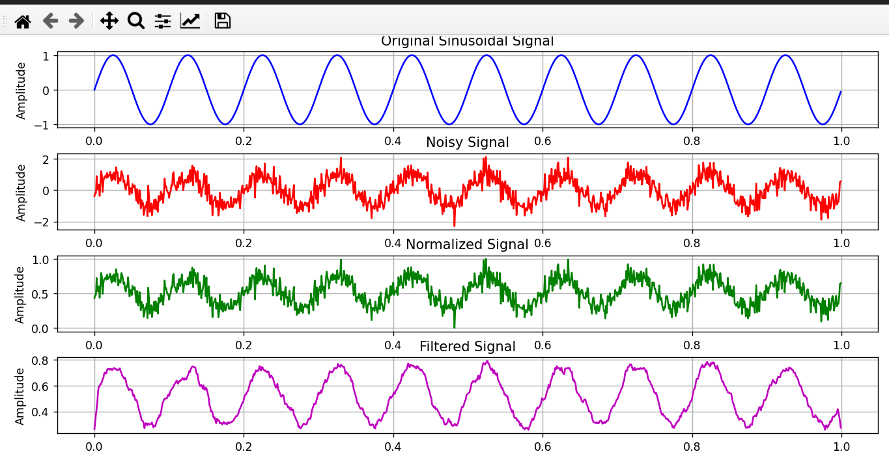

# Practical 01: Signal Preprocessing

## Aim

To perform normalization, noise removal, and filtering on time-domain signal data.

## Tools Used

- Python
- MATLAB

## Theory

Signal preprocessing is the first step in signal processing and machine learning.
It is used to improve the quality of raw signal data before applying feature
extraction and machine learning algorithms.

The main preprocessing operations performed in this practical are:

1. Normalization
2. Noise removal
3. Filtering

Normalization scales the signal values to a suitable range. It helps in
reducing the effect of different signal amplitudes.

Noise removal is used to reduce unwanted disturbances present in the original
signal.

Filtering is used to remove unwanted frequency components from a signal and
retain the required signal information.

## Algorithm

1. Load the time-domain signal data.
2. Read and inspect the input signal.
3. Normalize the signal values.
4. Identify and reduce unwanted noise.
5. Apply the required filter to the signal.
6. Plot the original and processed signals.
7. Compare the signals before and after preprocessing.
8. Save the processed output.

## Methodology

The input time-domain signal is first loaded using Python/MATLAB.
The signal is then normalized to bring its values into a suitable range.
Noise present in the signal is reduced using appropriate preprocessing
techniques. A filtering operation is then applied to obtain a cleaner signal.
Finally, the original and processed signals are plotted and compared.

## Files

- `practical01.py` – Python implementation
- `output.png` – Output of the practical
- `requirements.txt` – Required Python libraries
- `README.md` – Practical documentation

## Output

The output shows the signal before and after preprocessing, demonstrating
normalization, noise removal, and filtering.

## Conclusion

The time-domain signal was successfully preprocessed using normalization,
noise removal, and filtering techniques. The preprocessing improved the
quality of the signal and prepared it for further feature extraction and
machine learning tasks.
